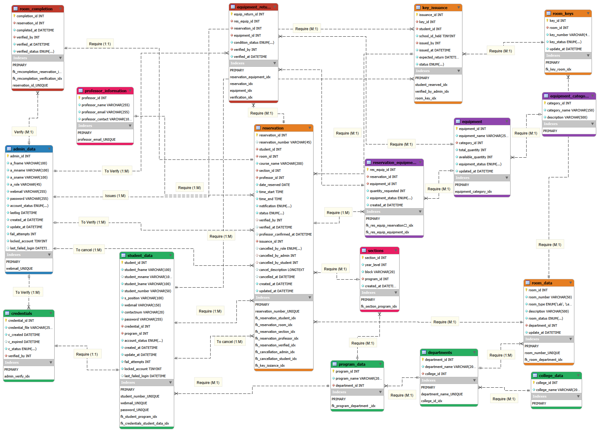
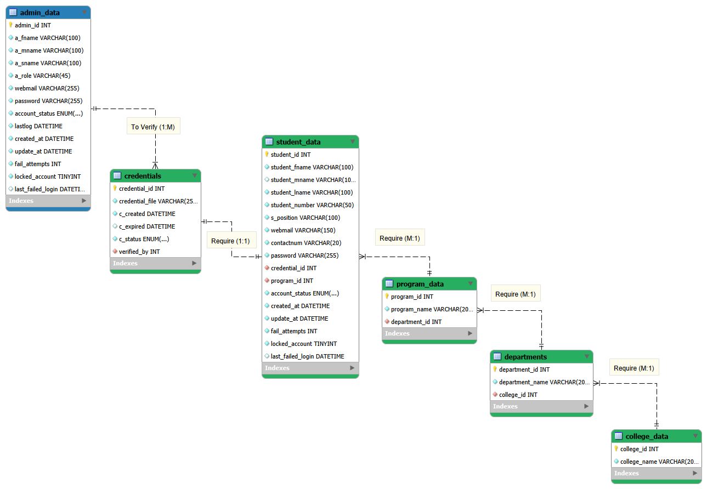
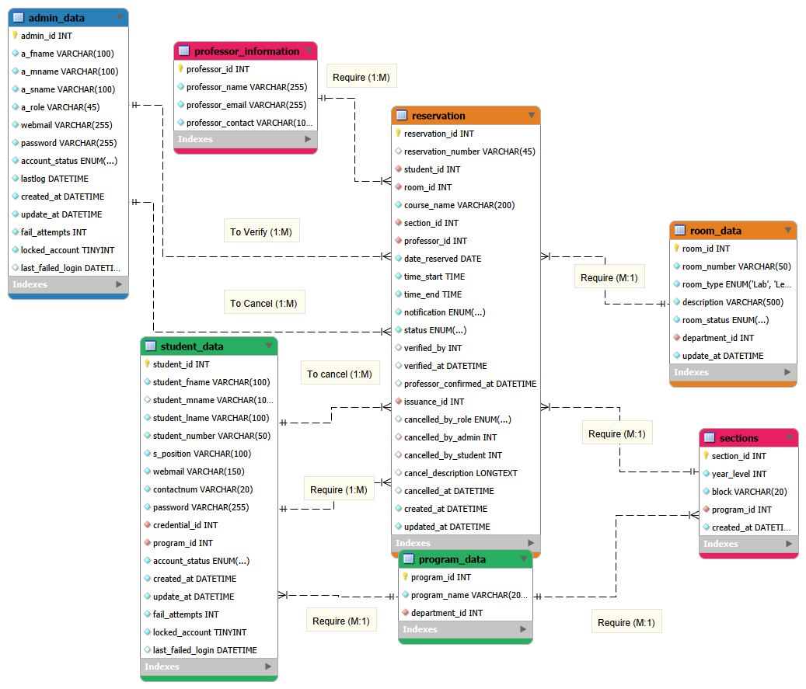
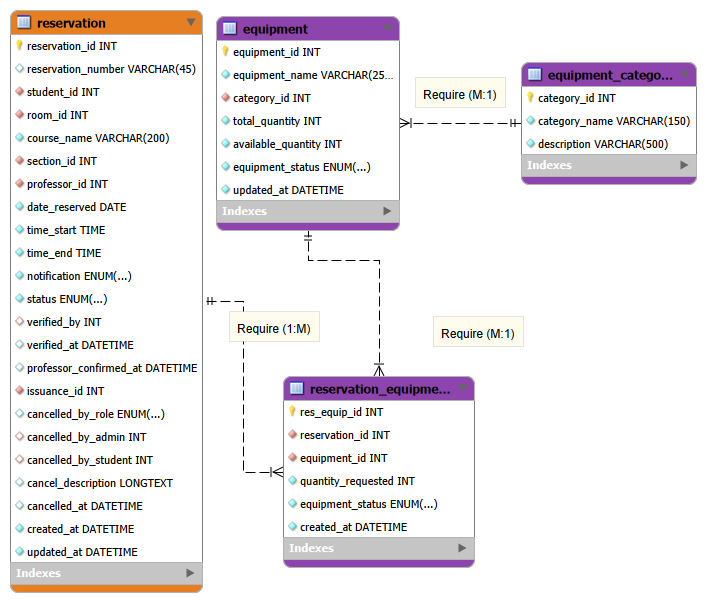
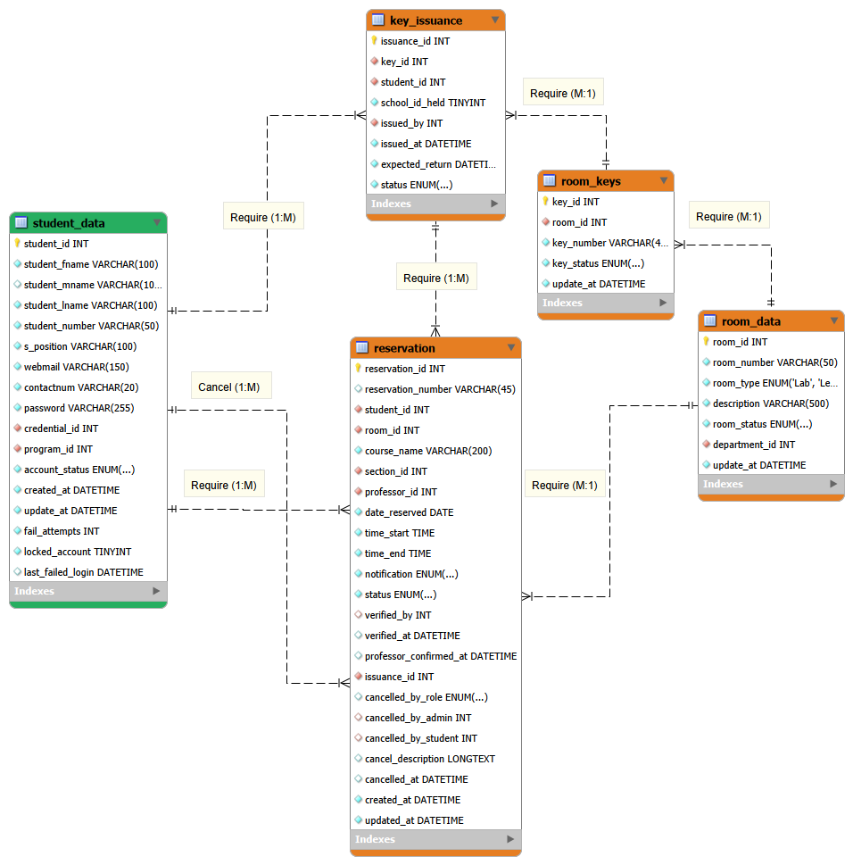
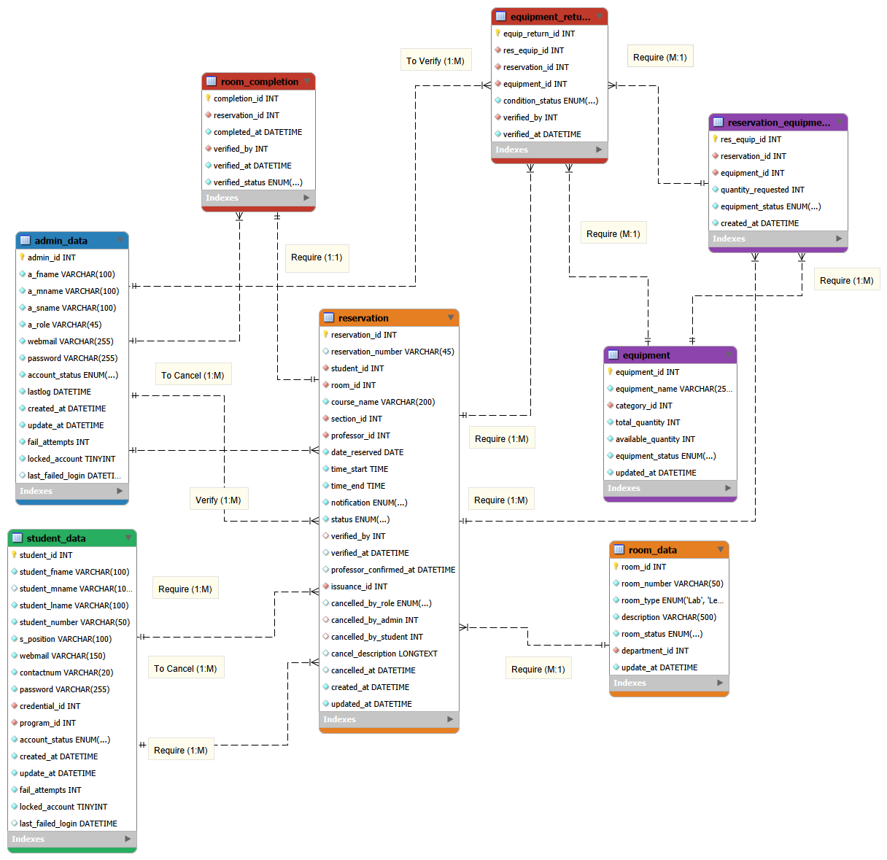

# CPEDSched Database Workflows

This folder contains the Entity Relationship Diagrams (ERDs) for the `cpedsched` (CPE Scheduling) database system.

The diagrams illustrate the table structures, relationships, and data flows for different core modules of the system. In addition to the full schema, several "workflow" diagrams are provided to show specific business processes in a cleaner, more focused view.

---

## 1. Full ERD Workflow

This diagram shows the complete, unabridged database schema for the `cpedsched` system. It includes every table and all relationships, serving as the master reference for the entire database structure.

---

## 2. Student Data Workflow

This view focuses on **student identity and academic context**. It details how a `student_data` record is linked to its academic hierarchy (`program_data`, `departments`, `college_data`) and its account verification status via the `credentials` and `admin_data` tables.

---

## 3. Reservation Workflow

This diagram illustrates the core **room reservation process**. It highlights the central `reservation` table and its connections to the key actors (`student_data`, `professor_information`, `admin_data`) and resources (`room_data`, `sections`). This workflow is the heart of the scheduling system.

---

## 4. Equipment Reservation Workflow

This diagram details the **many-to-many relationship** between a `reservation` and the `equipment` it requires. It shows how the `reservation_equipment` junction table acts as a "line item" list, linking a single reservation to multiple equipment items (and their categories).

---

## 5. Key Issuance Workflow

This view illustrates the process of **borrowing and returning physical room keys**. It shows how the `key_issuance` transaction table connects a `student_data` record, a specific `room_keys` item, and the original `reservation` that authorized the loan. This creates a clear audit trail for key accountability.

---

## 6. Completion Workflow

This final workflow diagram shows the **"check-out" or completion process** after a reservation is finished. It details how a `reservation` is linked to a `room_completion` record (for room check) and an `equipment_return` record (for item check-off). This entire process is verified by an `admin_data` to formally close the reservation.